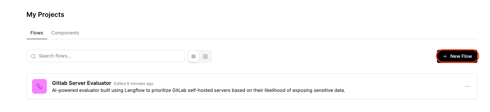
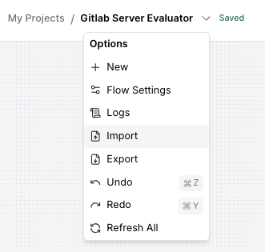
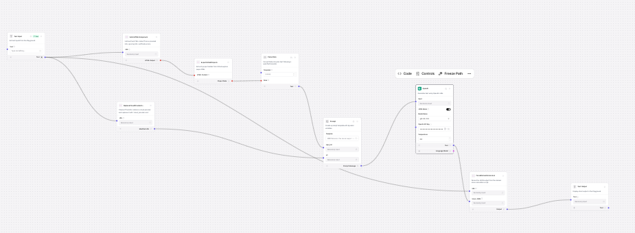
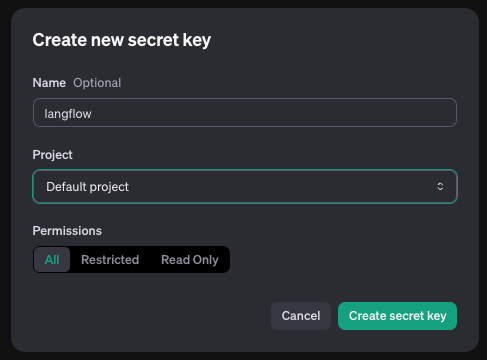
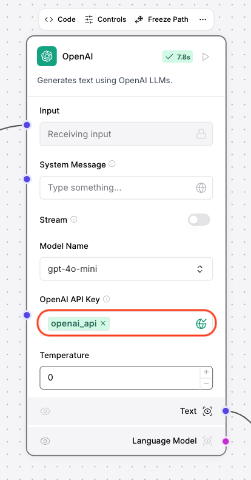

# Langflow Evaluator for GitLab Server Prioritization

## Overview

This project contains the source code for an AI-powered evaluator built using Langflow to prioritize GitLab self-hosted servers based on their likelihood of exposing sensitive data. The tool helps identify and scan the most critical GitLab servers by scoring them based on factors such as company size, repository activity, and data sensitivity.

## Problem

GitLab self-hosted servers, by default, expose an "explore" endpoint that allows anyone on the internet to access public data, including sensitive resources like projects and groups. In our research, we identified 30,000 public GitLab servers and faced the challenge of prioritizing which servers to scan for exposed secrets. This evaluator, built with Langflow, uses AI to score and prioritize servers based on relevant criteria.

## Solution

This project uses Langflow, an AI workflow platform, to create an intelligent system that:

- Identifies the company behind each GitLab server based on its URL.
- Evaluates the server's repository activity (e.g., forks, commits, last updated dates).
- Scores the server based on the likelihood of containing sensitive data.

# Installation

## Create Virtual Environment and Install Dependencies
```bash
python3 -m venv venv
source venv/bin/activate
pip install -r requirements.txt
```

# Usage

### Start Langflow
```bash
langflow run
```

### Import Project
1. Open Langflow, click **Create New Project**
   


2. Click **Import** and select the `langflow_components/Gitlab Server Evaluator.json` file.




### Configure OpenAI API Key
1. Generate an API key at [platform.openai.com](https://platform.openai.com).



2. Add the API key in Langflow settings.




### Obtain Langflow API URL
- Click **API** in Langflow and copy the endpoint's URL (e.g., `http://127.0.0.1:7860/api/v1/run/<workflow-id>?stream=false`).

### Run Query Script
```bash
python utils/query_langflow.py -u http://127.0.0.1:7860/api/v1/run/<workflow-id>?stream=false \
    -i gitlab_server_urls.txt -o outputs
```

### Calculate Scores
```bash
python utils/calculate_domain_score.py -i outputs/langflow_query_results.json -o outputs/prioritized_gitlab_servers.json
```

### Output
Open `outputs/prioritized_gitlab_servers.json` to view the prioritized GitLab servers based on their scores.
